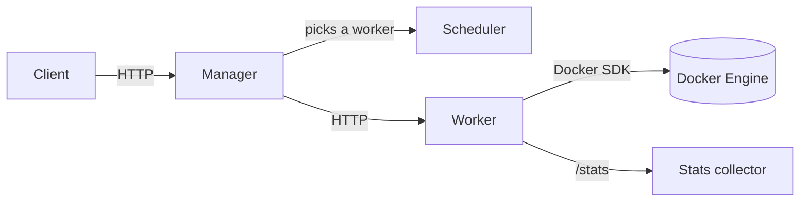

# Cube Orchestrator

A container orchestrator built from scratch in Go. Workers run tasks as Docker containers, expose an HTTP API, and report their own resource stats. The manager and scheduler layers that coordinate multiple workers are the next milestone.

Built while working through [*Build an Orchestrator in Go (From Scratch)*](https://www.manning.com/books/build-an-orchestrator-in-go-from-scratch) by Tim Boring (Manning). This is a learning project: the goal is to understand how orchestrators like Kubernetes and Nomad work internally, not to replace them.

**Progress:** Parts 1-2 complete (worker, worker API, metrics). Starting Part 3 (manager).

<!-- WHY: the first paragraph answers "what is this, and what works?" in 10 seconds.
     The Progress line sets honest expectations. Update it each time you finish a Part. -->

## Status

| Component | Status | Notes |
|---|---|---|
| Task + Docker runner | Working | Run, start, stop; async log streaming via the Moby SDK |
| Worker | Working | Task queue, state transitions, HTTP API (chi) |
| Stats | Working | Memory, disk, CPU via `goprocinfo`; exposed at `/stats` |
| Manager | Planned (Part 3) | Skeleton only |
| Scheduler | Planned | Skeleton only |
| Node | Planned | Skeleton only |

<!-- TODO: verify every row against your code before publishing.
     Change "Working" to "Partial" anywhere you have not run it end to end. -->

## Architecture

Target architecture. Solid pieces exist today; the manager and scheduler are planned.



| Package | Responsibility | Status |
|---|---|---|
| `task/` | Task model, state definitions, Docker wrapper (run/stop, log streaming) | Working |
| `worker/` | Owns the task queue, runs tasks, serves the worker HTTP API | Working |
| `stats/` | Collects CPU, memory and disk metrics for a node | Working |
| `manager/` | Accepts tasks and routes them to workers | Planned |
| `scheduler/` | Decides which worker should run a task | Planned |
| `node/` | Represents a machine and its capacity | Planned |

<!-- WHY: the diagram shows the intended design, the table shows who owns what.
     Together they show you understand separation of concerns, not just the code.
     When Part 3 lands, flip manager/scheduler/node to Working. -->

## Task lifecycle

<!-- TODO: replace with your real states from task/. Example shape only: -->

```
Pending -> Scheduled -> Running -> Completed
                           \-----> Failed
```

1. A task is submitted to a worker and placed on its queue.
2. The worker's execution loop dequeues it and starts a container through the Docker SDK.
3. State transitions are recorded as the container starts, runs, stops or fails.
4. Logs are streamed asynchronously so the worker is not blocked while the container runs.

<!-- TODO: confirm each step matches worker/ code, and name the real functions
     (e.g. RunTask, StartTask, StopTask) next to the steps. -->

## Getting started

### Prerequisites

- Go (see `go.mod` for the version)
- Docker Engine running locally

### Run the worker

```bash
git clone https://github.com/Izenberk/cube-orchestrator.git
cd cube-orchestrator
cp .env.example .env     # then edit values
go run .
```

### Configuration

| Variable | Purpose | Example |
|---|---|---|
| `TODO` | TODO | TODO |

<!-- TODO: fill from your .env.example. One row per variable. -->

### Try it

```bash
curl http://localhost:<PORT>/stats
```

<!-- TODO: use your real port, add a task-submit example, paste a trimmed real response. -->

## Design decisions

- **Moby SDK instead of the older Docker client.** <!-- TODO: your reason, from commit a6876d8 -->
- **Async log streaming.** <!-- TODO: what would block or break if logs were read synchronously? -->
- **One package per concept** (`task`, `worker`, `stats`, ...). <!-- TODO: what does this buy you for testing and swapping parts? -->
- **Config through environment variables** (`godotenv` + `.env.example`), so ports and secrets stay out of code.

<!-- WHY: interviewers read this section most. Keep 3-5 bullets,
     each as "I chose X because Y", not a feature list. -->

## What I added beyond the book

<!-- TODO: keep this short and honest. Only list what you changed or extended yourself.
     Possible candidates from your history (confirm each against the book's version):
     Moby SDK modernization, env-based configuration.
     Leave it as "Nothing yet" if that is true; add items as you extend the project. -->

## Roadmap

Follows the book's structure, plus my own extensions.

- [ ] **Part 3: Manager** - task dispatch, manager API, failure handling
- [ ] **Part 4: Refactorings** - a more sophisticated scheduler, persistent task storage
- [ ] **Part 5: CLI** - command-line interface
- [ ] **Beyond the book** - tests for the worker state machine, ...

## Known limitations

- Single worker only until the manager lands (Part 3)
- Task state is not persisted yet (planned in Part 4)
- <!-- TODO: add anything else you know is not handled -->

## Credits

Architecture and structure follow *Build an Orchestrator in Go (From Scratch)* by Tim Boring (Manning).
